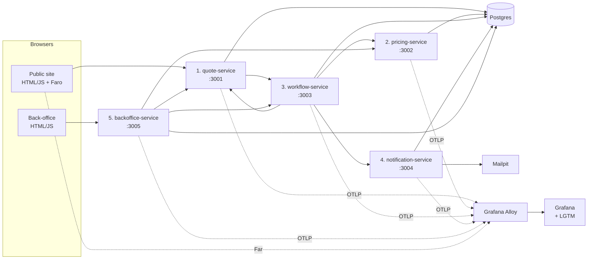
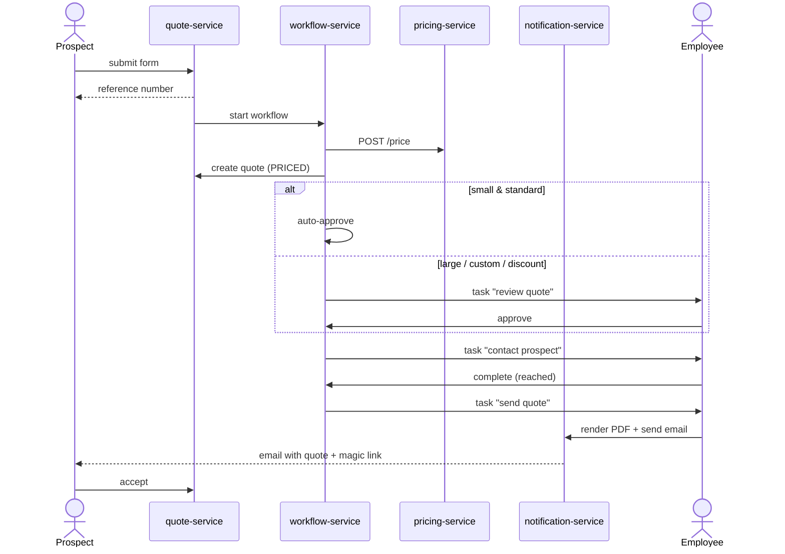

# Assurance — Architecture Plan

A **demo** health-insurance company. Five Node.js/Express microservices, one Postgres, a
public quote form, and a back-office where an employee turns a request into a quote and
sends it.

> **Provenance.** The economic model is inspired by Alan's publicly documented approach:
> the insurance premium is priced to break even against expected claims, small
> organizations are protected by pooling, and revenue comes from a per-member
> subscription rather than an insurance margin. The demo company is fictional and called
> **Assurance**.

**This is a demo.** It is optimised to be understandable in 10 minutes and to run on a
laptop with one command. §10 lists what was deliberately left out.

> **Status: built and running.** All five services exist and work end to end —
> `make up && make demo && make seed && make smoke`. Where the build diverged from this
> plan, the plan has been corrected to match the code; see README.md to run it.

---

## 1. The five services

All Node.js 22 + Express 5, each generated from the `njsexpress` template so they share
one shape: `server/server.js`, a `public/` folder, and OpenTelemetry wired through
`NODE_OPTIONS`. Each owns its own tables and talks to the others over plain HTTP/JSON.

Every container listens on **8080** internally (the template's port); the ports below are
the host mappings from `docker-compose.yml`.

| # | Service | Port | Responsibility |
|---|---|---|---|
| 1 | **quote-service** | 3001 | Public API + serves the public site. Owns organizations, quote requests, quotes, and the quote state machine. |
| 2 | **pricing-service** | 3002 | The business model. Computes `Z`, expected claims, premium, and subscription. Stateless apart from its reference tables. |
| 3 | **workflow-service** | 3003 | The business process. Reacts to a new request, orchestrates pricing, creates and tracks the employee tasks, runs follow-up timers. |
| 4 | **notification-service** | 3004 | Renders the quote PDF and sends email. |
| 5 | **backoffice-service** | 3005 | Employee API + serves the back-office UI. Login, task list, quote workbench, send. |



No API gateway: each of the two Express apps serves its own static frontend, so
everything is same-origin and there's no CORS or proxy to explain.

### 1. `quote-service`

The public face and the system of record.

- Serves `quote-service/public/` as static files.
- `POST /api/quote-requests` — the form submission. Validates, stores the organization +
  contact + workforce numbers + coverage choice, returns a reference number, then calls
  `workflow-service` to start the process.
- `GET /api/quotes/:id?token=…` — the prospect's magic-link view of their quote.
- `POST /api/quotes/:id/accept` / `/decline`.
- Internal: `POST /internal/quotes`, `PATCH /internal/quotes/:id` (state transitions,
  rejects illegal ones with `409`).

### 2. `pricing-service`

Pure business logic, ~200 lines of it, and the most interesting file in the repo.

```js
// Pooling: how much of the org's own claims history do we trust?
const Z = Math.min(1, Math.sqrt(memberYears / 3000));   // 0 for a first-year client

// Blend own experience with the peer group (industry × size × age mix)
const expectedClaims = Z * ownClaimsPerMember + (1 - Z) * peerClaimsPerMember;

const premium = expectedClaims * coverageFactor / 12 * (1 + TAX);   // per member/month
const subscription = SUBSCRIPTION_GRID[sizeBand];                   // per member/month
```

The premium is priced to break even — target margin zero. The subscription is the
revenue. Two rules the code enforces, because they *are* the business model: an employee
can discount the **subscription** only (discounting the premium returns `422`), and every
quote stores its `Z`, its inputs, and its breakdown so any price can be explained.

- `POST /price` → `{ Z, expectedClaims, premium, subscription, breakdown[], rationale[] }`
- `POST /price/simulate` — same, with employee overrides (coverage level, subscription
  discount). Called on every keystroke in the workbench, debounced.
- `GET /peer-groups`, `GET /coverage-levels` — the reference tables, seeded from JSON in
  `data/`.
- Returns `rationale[]` as plain sentences ("12 members, first year → fully pooled") that
  the UI and the PDF render directly.

### 3. `workflow-service`

The business process, as an explicit state machine plus a task table. No workflow engine —
a `setInterval` tick every 30s handles timers, which is plenty for a demo.

- `POST /workflows` — start: fetch pricing, create the quote, then decide:
  - **straight-through** (under 250 members and `Z ≤ 0.5`) → auto-approve, create the
    *contact* task;
  - **referral** (250+ members, or `Z > 0.5` so the price leans on the organisation's own
    experience) → create the *review* task for an actuary first.
  Both thresholds are env vars (`REFERRAL_HEADCOUNT`, `REFERRAL_Z`) so you can make any
  case referable on stage.
- `GET /tasks?role=…&status=open` — the employee work queue.
- `POST /tasks/:id/claim`, `POST /tasks/:id/complete` — the employee actions that advance
  the process.
- The tick handles: follow-up reminder at D+3, unreachable after 3 contact attempts, quote
  expiry at D+60.

### 4. `notification-service`

- `POST /documents/quote` — renders the quote PDF with **pdfkit** (pure JS, no headless
  browser), writes it to a volume, returns a URL. Idempotent per `(quote, version)`.
- `POST /emails` — sends via **nodemailer** to **Mailpit**, whose web UI on `:8025` means
  the audience literally watches the email arrive.
- Templates: quote-ready (with the magic link), follow-up nudge, expiry warning.

### 5. `backoffice-service`

- Serves `backoffice-service/public/` as static files.
- Minimal auth: three seeded users (`advisor`, `actuary`, `supervisor`), signed JWT cookie.
- Aggregates for the UI so the browser makes one call per screen: `GET /api/tasks`,
  `GET /api/cases/:quoteId`, `POST /api/cases/:quoteId/simulate`,
  `POST /api/cases/:quoteId/escalate`, `POST /api/tasks/:id/complete`, `GET /api/portfolio`.
- Enforces discount authority: advisor ≤ 5%, actuary ≤ 15%, supervisor above that. Over
  your limit returns `403` with an offer to escalate, which creates a supervisor task.

---

## 2. The two web apps

Plain HTML + CSS + vanilla JS. No framework, no build step.

**`quote-service/public/`** — a 3-step quote form:

1. **Your company** — name, industry, headcount, year founded.
2. **Your team** — age mix (three sliders), family composition mix.
3. **Coverage & contact** — Essential / Comfort / Premium, then name, email, phone.

Then a confirmation with the reference number and "an advisor will call you within 24
hours". Also serves the magic-link quote page: the two-line price, the pooling
explanation, the benefit table, the PDF, and Accept / Decline.

**Grafana Faro** loaded from CDN — Web Vitals, JS errors, and `fetch` instrumentation
that propagates `traceparent`, so a click in the browser and its backend trace are *one
trace*. This is the best thing in the demo; don't cut it.

**`backoffice-service/public/`** — three screens:

- **Tasks** — the queue, filterable by role, showing company, members, pooling and age.
- **Case** — the two price lines, the pooling bar showing `Z` with its rationale, the full
  breakdown, the adjust panel, the next action, and the history.
- **Portfolio** — every quote with its state, and the headline counts.

The Case screen is where the demo spends its time. *Adjust* changes coverage or applies a
subscription discount and re-prices live — try to discount the premium and it refuses.
*Next action* renders whichever task is open, so the same screen approves a referral, logs
a call outcome, or renders and sends the PDF depending on where the case has got to.

---

## 3. The business process



Quote states:

```
NEW → PRICED → [UNDER_REVIEW] → APPROVED → CONTACTED → SENT → ACCEPTED
                     ↓                          ↓         ↓
                 DECLINED                  ABANDONED   EXPIRED / REFUSED
```

---

## 4. Data

One Postgres, one schema per service. Services only ever read and write their own schema.

| Schema | Tables |
|---|---|
| `quote` | `organizations`, `quote_requests`, `quotes`, `quote_versions`, `state_transitions` |
| `pricing` | `peer_groups`, `coverage_levels`, `subscription_grid`, `pricing_audit` |
| `workflow` | `workflows`, `tasks`, `contact_attempts` |
| `notification` | `messages`, `documents` |
| `backoffice` | `users` |

Schema creation is plain `CREATE TABLE IF NOT EXISTS` run by each service at startup
(`server/db.js`), with a connect-retry loop so boot order doesn't matter. A real
deployment would use `node-pg-migrate` or Flyway; for a demo, idempotent DDL in the
service that owns the tables is one less moving part.

**Seed data matters more than usual**, because the headline dashboard is a portfolio
metric. `make seed` pushes 100 synthetic organizations across size bands, industries and
tenures **through the real APIs** — nothing is written straight to the database — and
drives them to a spread of outcomes (accepted, refused, abandoned, still in the queue).
It takes about 10 seconds and makes the `Z`-by-size-band and revenue panels non-trivial
the moment you open Grafana.

`make demo` adds the three scripted cases: a 12-person startup (`Z = 0`,
straight-through), a 400-person manufacturer (`Z = 0.73`, referred to an actuary), and a
restaurant chain with an older workforce (out of appetite, politely declined by email).

A quarter of the seeded organizations are modelled as existing clients with claims
history, which is what gives `Z` a distribution rather than a single value.

---

## 5. Observability

The reason to build this rather than a to-do app: **the business model is a set of time
series.**

- **OpenTelemetry Node SDK** in all five services via one shared
  `require('./lib/tracing')` at the top of each entrypoint — auto-instruments Express,
  `http`, and `pg` with no per-route code. Add manual spans only for
  `pricing.compute`, `pdf.render`, and `workflow.tick`.
- **Span attributes with business meaning**: `quote.id`, `quote.state`, `org.size_band`,
  `org.industry`, `pricing.z_bucket`, `coverage.level`, `employee.role`. Bucketed, never
  raw — unbounded values go in spans and logs, never in metric labels.
- **Logs**: `pino` JSON to stdout, with `trace_id` injected, so Loki → Tempo is one click.
- **Grafana Faro** in the public site (see §2).
- **Pipeline**: everything → **Grafana Alloy** → Mimir / Loki / Tempo → Grafana. Flip two
  env vars to point at Grafana Cloud instead.

Three provisioned dashboards:

1. **Business model** — subscription revenue against premium volume (the two lines, kept
   visibly apart), pooling weight `Z` by company size, average premium and expected
   claims by industry, and a counter of premium discounts refused.
   *This is the one that makes the demo land.*

   **Loss ratio is deliberately not on it.** It is the metric this model is steered by,
   but it needs a year of real claims against active contracts — that is
   `contract-service`, which is out of scope (§10). Showing a fabricated loss ratio would
   undercut the one thing this demo is trying to be honest about.
2. **Sales funnel** — requests/day, conversion by state, time-to-quote, tasks waiting by
   age and role.
3. **Service health** — rate / errors / duration per service, plus the service graph from
   Tempo.

**Load and chaos:** one k6 script, and `make chaos-on` makes `pricing-service` slow (p99
1.5s) and 10% error-prone. The audience watches the funnel degrade and the traces go red
on exactly one span.

---

## 6. Repository layout

```
assurance/
├── README.md
├── docker-compose.yml
├── Makefile                    # up / seed / demo-load / chaos-on / down
├── quote-service/              # each service is standalone, as njsexpress generates it
│   ├── Dockerfile              #   package.json, node_modules, Dockerfile, deploy.yaml
│   ├── public/                 #   the public HTML/JS quote form lives here
│   └── server/                 #   server.js, db.js, log.js, metrics.js, states.js
├── pricing-service/            #   server/pricing.js + server/data/reference.json
├── workflow-service/           #   server/process.js — the business process
├── notification-service/       #   server/pdf.js, server/templates.js
├── backoffice-service/         #   public/ is the employee UI; server/auth.js
├── scripts/                    # smoke.js, seed.js, demo-cases.js, wait-for-health.sh
├── observability/
│   ├── alloy/config.alloy
│   └── grafana/dashboards/     # provisioned JSON + provider.yaml
└── load/quote-funnel.js        # k6
```

No monorepo tooling and no shared package: each service is exactly what
`njsexpress <name>` produces, with its own `package.json` and `node_modules`. `server/log.js`
and `server/db.js` are duplicated across the five on purpose — about forty lines each, and
the alternative is coupling five independently deployable services to a shared library for
no benefit at this size.

---

## 7. Running it

`make up` → 9 containers: the 5 services, Postgres, Mailpit, Alloy, and `grafana/otel-lgtm`
(Grafana + Prometheus + Loki + Tempo in one image). Cold start to a working demo is about
2 minutes, most of which is the image build.

Published ports: `3001` public site, `3002`–`3004` the internal services, `3005` back
office, `3000` Grafana, `8025` Mailpit, `12345` Alloy, `12347` the Faro receiver.

`make up` ends by polling every service's `/health` before it returns, so the next command
in a script can rely on the stack being ready.

**Kubernetes.** `make k8s-deploy` puts the same stack on whatever cluster `kubectl` points
at — each service keeps its own `deploy.yaml` (Deployment + ClusterIP Service, generated by
`njsexpress` and filled in), with Postgres and Mailpit in `k8s/`. It assumes the cluster
already runs Alloy and pulls images from Docker Hub, so it deploys no observability stack,
no registry, no NodePort and no Ingress. Local access is `make k8s-forward`, which
port-forwards onto the compose ports so every script and URL works unchanged.
`make k8s-smoke` runs the identical 15-step test against it. See README.md.

---

## 8. Build plan

| Phase | Deliverable | Done when |
|---|---|---|
| **0** | Compose, Postgres, one Express skeleton, shared `lib/`, OTel wired, Grafana up | A request produces a trace in Tempo |
| **1** | `pricing-service` + seeded reference data | `curl` a company profile → premium, subscription, `Z`, and a rationale |
| **2** | `quote-service` + the public form | A form submission returns a reference number and a stored, priced quote |
| **3** | `workflow-service` + `backoffice-service` + the employee UI | An employee reviews, adjusts, and approves a referred quote |
| **4** | `notification-service` | Prospect gets the PDF by email and accepts via the magic link |
| **5** | Seed portfolio, three dashboards, Faro, k6, chaos toggle, README | The Business model dashboard shows a real loss-ratio distribution |

Phase 1 first on purpose: the pricing logic is the opinionated part, and everything else
just displays its output.

---

## 9. Demo script (10 minutes)

1. **Public site.** Quote for a 12-person startup, Comfort level. Submit → reference
   number.
2. **Grafana.** The request appears on the funnel. Open the trace: one trace, browser
   click → four services, with `pricing.compute` right there as a named span.
3. **Back-office.** Auto-approved, straight-through. Two lines — premium and subscription
   — and the pooling bar reading **`Z = 0` — "12 members, first year → fully pooled"**.
   Say it out loud: *we don't make money on the premium.*
4. **Second case: 400-person manufacturer, 4 years of history.** Goes to review. `Z = 0.7`
   — priced on its own experience.
5. **Adjust:** change coverage, watch it re-price live. Apply a 12% discount on the
   **subscription**. Then try to discount the **premium** → `422`. That refusal *is* the
   business model, in code.
6. **Contact, then send.** Preview the PDF, send, open Mailpit — the email is there.
7. **Magic link as the prospect:** accept. The funnel ticks over.
8. **`make chaos-on`** + k6. p95 climbs, traces go red on `pricing.compute`, the funnel
   visibly slows. Turn it off, watch it recover.

---

## 10. Deliberately left out

Stated plainly so nobody mistakes the demo for a reference architecture:

| Not here | What you'd add for real |
|---|---|
| Message broker | Kafka/NATS between quote and workflow; here it's a direct HTTP call |
| Workflow engine | Temporal or Camunda; here it's a state machine and a 30s tick |
| Real auth | Keycloak/OIDC; here it's three seeded users and a JWT cookie |
| API gateway | Traefik/Kong; here each app serves its own frontend |
| Database per service | One Postgres with a schema per service |
| Real actuarial model | Seeded lookup tables and a square-root credibility formula |
| Regulatory compliance | Statutory minimum benefits, premium tax rules, contract-compliance criteria |
| Individual health data | The demo holds **none** — workforce data is aggregate counts, claims are simulated at category level. Worth saying out loud to an insurance audience. |

---

## Appendix — Glossary

| English (used here) | French original |
|---|---|
| Insurance premium | Cotisation |
| Subscription | Abonnement |
| Pooling / credibility factor `Z` | Mutualisation / coefficient de crédibilité |
| Loss ratio | S/C (sinistres / cotisations) |
| Coverage level | Garanties |
| Quote | Devis |
| Headcount | Effectif |
| Advisor / actuary / supervisor | Conseiller / actuaire / responsable |
